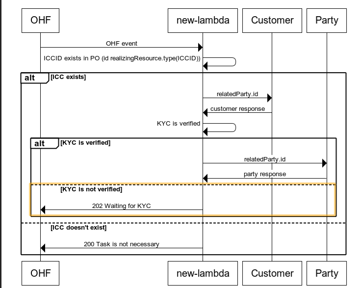

## About

The product specification μS hold the business logic, API, and micro processes involved in the lifecycle of product specification for DBX catalog.
API is based on [TMF622 - Product Ordering Management](https://www.tmforum.org/resources/specification/tmf622-product-ordering-management-api-rest-specification-r19-0-0/)

### Required tools and utilities

- Visual Studio code (<https://code.visualstudio.com/download>)
- Terraform (<https://www.terraform.io/downloads.html>)
- Node JS (<https://nodejs.org/en/>)
- AWS CLI (<https://aws.amazon.com/cli/>)

For local testing you can use LocalStack - a fully functional local AWS cloud stack (<https://github.com/localstack/localstack>)

To set up a development environment, please follow these steps:

1. Clone the repo

`https://github.com/amarrategui/technical-test-ts.git`

# Technical test with TypeScript and Terraform

The goal of this technical test is to create an application similar to the one provided in the provided flow: 

<div align="center">



Test flow for AMDOCS 
</div>

To achieve this, you must use the following API:

https://api.jsonbin.io/v3 

- X-Access-Key: $2a$10$V3/VvVpsP0ZzVJO3Q5cmxewjfsd7SCzW0iP3EGU2SOaBhICoyBuKi
- Customer API: https://api.jsonbin.io/v3/b/6552443654105e766fcf7c4d
- Party API:    https://api.jsonbin.io/v3/b/65524a2654105e766fcf7ecd


Steps:

- [] Fetch Customer and Party data using the API whit 'axios'.
- [] Develop the flow as you consider within the route: "./src/technical-test-ts". You need to create the logic for both the main lambda and the Callback lambda.
- [] Modify the lambda entry points if necessary for the application to work.
- [] Handle any potential errors that may occur.
- [] Add Terraform required files for the flow.
- [] E2E Testing.


### Running the app

```bash
# starting the μS
$ npm run start

# starting the μS in a watch mode
# (it triggers recompilation and restart on any file change so it can slow down your laptop)
$ npm run start:dev

# running the code in production mode
$ npm run build
$ npm run start:prod
```
